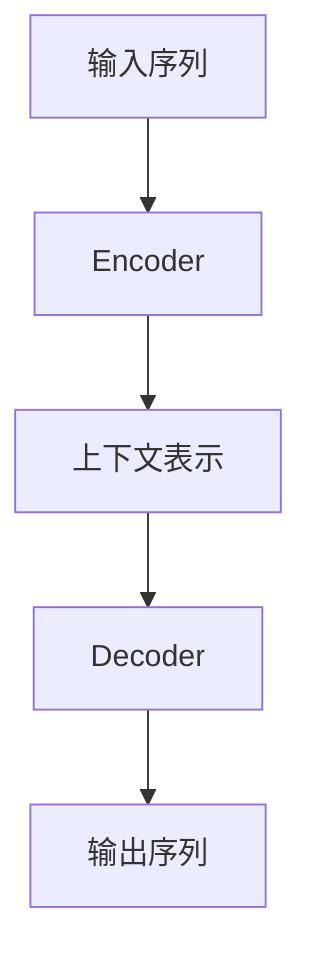
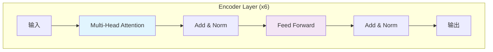
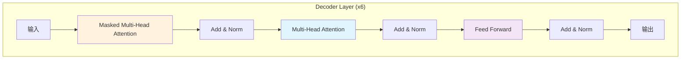

# Attention Is All You Need

**Transformer: 基于注意力机制的序列转换模型**

Ashish Vaswani, Noam Shazeer, Niki Parmar, et al.
Google Brain / Google Research

---
layout: section
---

## 研究背景

---

# 传统序列模型的问题

### RNN/LSTM的局限性
<div class="grid grid-cols-2 gap-4">

<div>

**🤔 主要问题**
- 顺序计算依赖
- 难以并行化
- 长距离依赖问题
- 训练时间长

</div>
<div>

**📊 现状**
```python
# 传统的RNN结构
for t in range(seq_len):
    h_t = f(h_{t-1}, x_t)
    # 必须顺序计算
```

</div>
</div>

---
layout: two-cols
---

# 研究动机

::left::

## ⚠️ 核心问题
**序列处理的固有瓶颈**
- 计算沿时间步展开
- 隐藏状态递归依赖
- 批量处理受限
- 长序列训练困难

::right::

## 💡 解决方案
**完全基于注意力的架构**
- 去除循环连接
- 全局依赖建模
- 高度并行化
- 更短训练时间

---

# Transformer 创新点

<v-clicks>

1. **完全基于注意力机制**
   - 摒弃RNN/CNN
   - 自注意力机制

2. **并行计算优势**
   - 训练速度显著提升

3. **全局上下文建模**
   - 长距离依赖有效捕捉

4. **简单而强大**
   - 相对简单的架构

</v-clicks>

---
layout: section
---

## 模型架构

---

# 整体架构概览

<div class="grid grid-cols-2 gap-4">
<div>

### Encoder-Encoder 结构


</div>
<div>

### 核心组件
- **N = 6 个相同层**
- 多头注意力机制
- 前馈神经网络
- 残差连接 + LayerNorm

</div>
</div>

---

# Encoder 详细结构



<v-click>

**每个Encoder层包含：**
1. **多头自注意力层**
2. **前馈神经网络层**
3. **残差连接 + 层归一化**

</v-click>

---

# Decoder 详细结构



<v-click>

**Decoder 额外组件：**
- **Masked 多头注意力**（防止信息泄露）
- **编码器-解码器注意力层**

</v-click>

---

# 注意力机制

## Scaled Dot-Product Attention

$$
\text{Attention}(Q, K, V) = \text{softmax}\left(\frac{QK^T}{\sqrt{d_k}}\right)V
$$

<div class="grid grid-cols-2 gap-4 mt-8">

<div>

**公式说明：**
- $Q$: Query 矩阵
- $K$: Key 矩阵  
- $V$: Value 矩阵
- $d_k$: Key的维度

</div>

<div>

**缩放因子 $\sqrt{d_k}$:**
- 防止点积过大
- 稳定梯度传播

</div>

</div>

---

# 多头注意力机制

<v-clicks>

## 核心思想
**并行多个注意力头**
- 不同的表示子空间
- 联合关注不同位置

## 数学表达
$$
\begin{aligned}
\text{MultiHead}(Q,K,V) &= \text{Concat}(head_1,...,head_h)W^O \\
\text{where } head_i &= \text{Attention}(QW_i^Q, KW_i^K, VW_i^V)
\end{aligned}
$$

</v-clicks>

<v-click>

## 参数配置
**论文设置：**
- $h = 8$ 个注意力头
- $d_k = d_v = d_{model}/h = 64$
- $d_{model} = 512$

</v-click>

---
layout: section
---

## 实验与结果

---

# 机器翻译实验结果

<div class="grid grid-cols-2 gap-8">

<div>

## WMT 2014 English-German
| 模型 | BLEU |
|------|------|
| 最佳现有模型 | 26.4 |
| **Transformer (论文)** | **28.4** |
| 改进幅度 | **+2.0 BLEU** |

</div>

<div>

## WMT 2014 English-French
| 模型 | BLEU |
|------|------|
| 最佳现有模型 | ~41.0 |
| **Transformer (论文)** | **41.8** |
| 训练时间 | **3.5天** |

</div>

</div>

---

# 训练效率对比

<v-clicks>

## ⚡ 显著优势
**训练速度大幅提升**
- 8 P100 GPUs上仅需12小时训练
- 比RNN/CNN架构快得多
- 更好的硬件利用率

## 📈 可扩展性
- 更易并行化
- 适合大规模训练
- 计算资源利用率高

</v-clicks>

---
layout: two-cols
---

# 模型优势总结

::left::

## 🚀 技术优势
1. **完全并行化**
2. **全局依赖建模**
3. **训练效率高**
4. **架构简单**

::right::

## 🎯 性能优势
1. **翻译质量SOTA**
2. **训练时间大幅减少**
3. **可扩展性强**
4. **泛化能力好**

---

# 局限性与未来工作

<div class="grid grid-cols-2 gap-4">
<div>

## 当前局限
- 固定上下文长度
- 二次计算复杂度
- 位置编码简单

</div>
<div>

## 未来方向
- 扩展到多模态
- 处理图像/音频/视频
- 局部注意力机制
- 减少生成顺序性

</div>
</div>

---
layout: section
---

## 影响与意义

---

# Transformer 的影响力

<v-clicks>

## 🌟 革命性贡献
1. **开创注意力先河**
2. **奠定现代NLP基础**
3. **催生BERT/GPT等模型**

## 📚 范式转变
- 从RNN到注意力
- 预训练+微调范式
- 大规模模型时代

## 🏆 长期影响
- 计算机视觉应用
- 多模态学习
- 通用人工智能

</v-clicks>

---

# 关键启示

<v-clicks>

## 🧠 核心思想
**"注意力就是一切"**
- 简单机制，强大能力
- 摆脱序列计算束缚
- 开启新的研究方向

## 💡 方法论启示
1. **重新思考基础架构**
2. **关注计算效率**
3. **平衡简单性与性能**

</v-clicks>

---
layout: cover
---

# 总结

## Transformer 的核心价值

**将注意力机制从配角变为主角**

<v-clicks>

- 🎯 **创新性**：完全基于注意力的架构
- ⚡ **效率性**：显著的训练加速
- 🏆 **有效性**：多项任务达到SOTA
- 🌍 **影响力**：改变NLP研究范式

</v-clicks>

---

# Q&A

## 讨论与交流

**思考问题：**
1. Transformer如何克服RNN的局限性？
2. 多头注意力的优势是什么？
3. 为什么位置编码很重要？
4. Transformer在哪些方面还可以改进？

**参考文献：**
- Vaswani et al. (2017). *Attention Is All You Need*
- 相关扩展工作：BERT, GPT, T5, ViT等

---

```yaml
# Slidev 配置 (frontmatter)
theme: seriph
background: https://source.unsplash.com/collection/145103/1920x1080
highlighter: shiki
lineNumbers: true
drawings:
  persist: false
transition: slide-left
titleTemplate: '%s - Transformer 论文解读'
```

这个Slidev演示文稿包含了Transformer论文的所有核心内容，采用清晰的层次结构和视觉效果展示。你可以直接复制使用或根据需要进行调整！